# Signal Protocol + SysMaint Monorepo
## Architecture and Code Guide

This guide explains the project in plain language first, then technical detail.
It is written for someone who wants to understand both:
- how the system works end-to-end, and
- where to read in the codebase to verify behavior.

---

## Introduction

This project combines **Signal Protocol end-to-end encryption (E2EE)** with a **SysMaint Agentic AI workflow** for operations and diagnostics.

In simple terms:
- Users and services exchange messages through Signal-Protocol encrypted envelopes.
- A relay server routes those envelopes.
- A SysMaint AI agent decrypts allowed messages, runs tools, and sends encrypted replies.
- A web dashboard shows status, test history, and AI/test overview outputs.

The most important point: **Signal E2EE is the primary trust boundary**.
The relay is for routing. It is not the place where plaintext business logic should live.


### How to read this guide

If you are new, read in this order:
1. `Section 1` (big picture)
2. `Section 3` (Signal E2EE in this repo)
3. `Section 5` (real runtime flows)
4. `Section 7` (where data is stored)

---

## Key Features

- **Signal Protocol as core transport security**: X3DH session setup + Double Ratchet message progression.
- **Agentic AI inside encrypted flows**: the SysMaint agent receives and returns data through Signal envelopes.
- **Typed protocol boundaries**: transport envelope schema + SysMaint message schema validation.
- **Hybrid relay delivery**: HTTP ingestion and WebSocket delivery with queued offline messages.
- **Operational test platform**: 15 tests, retries, SSE progress, history, and exports.
- **Deno analysis integration**: test overview reports generated externally and fed back into encrypted workflows.
- **SQLite-first local persistence**: simple, inspectable, low-friction setup for development and demos.

### E2EE-first focus

In this project, E2EE is not a side feature. It is central to system design:
- App payloads are serialized and encrypted before relay transport.
- Relay can route envelopes but is not intended to inspect plaintext payload data.
- SysMaint AI behavior is triggered after decryption at trusted endpoints.

---

## Quick Index

- [Glossary (Quick Terms)](#glossary-quick-terms)
- [1. System Topology](#1-system-topology)
- [2. Monorepo Layout and Ownership](#2-monorepo-layout-and-ownership)
- [3. Signal Protocol E2EE in This Repo](#3-signal-protocol-e2ee-in-this-repo)
- [4. Relay Server Internals](#4-relay-server-internals)
- [5. Core Runtime Flows](#5-core-runtime-flows)
- [5.5 LangChain + OpenAI integration](#55-langchain--openai-integration-in-sysmaint-agent)
- [6. Web API Surface](#6-web-api-surface)
- [7. State and Persistence](#7-state-and-persistence)
- [8. Agentic Test Suite Mechanics](#8-agentic-test-suite-mechanics)
- [9. Infrastructure and Runtime Composition](#9-infrastructure-and-runtime-composition)
- [10. Security Guarantees and Limits](#10-security-guarantees-and-limits)


---

## Glossary (Quick Terms)

- **Envelope**: transport wrapper around encrypted body.
- **Bootstrapping**: one-time setup phase where identity, prekeys, and initial session state are established.
- **X3DH**: initial Signal key agreement used to create the first shared secret between peers.
- **Double Ratchet**: per-message key evolution algorithm that advances sending/receiving chains.
- **Identity key pair**: long-term key pair that identifies a participant and signs medium-term keys.
- **Signed prekey**: medium-term public key signed by the identity key to prove authenticity.
- **One-time prekey**: ephemeral prekey consumed during initial session establishment.
- **Kyber prekey**: post-quantum prekey (`CRYSTALS-Kyber`) used for PQ-hybrid session setup in this repo.
- **KEM (Key Encapsulation Mechanism)**: method for establishing shared key material using public-key encapsulation.
- **PreKey bundle**: published public key package (`identity`, `signedPreKey`, `preKey`, `kyberPreKey`) used by peers to start sessions.
- **Session**: stored cryptographic state for a peer pair, including ratchet progress.
- **PreKey message**: first encrypted message type (`type=2`) used for session bootstrap.
- **Whisper message**: follow-up encrypted message type (`type=1`) for established sessions.
- **Whisper (this project)**: Signal `SignalMessage` ciphertext type, not OpenAI Whisper speech-to-text.
- **CiphertextMessageType**: Signal enum distinguishing `PreKey` vs `Whisper` ciphertext handling paths.
- **KDF (Key Derivation Function)**: function that derives strong cryptographic keys from key material/password input.
- **Forward secrecy**: old messages remain protected if later key material is exposed.
- **Post-compromise security**: future messages can recover confidentiality after ratchet state advances.

---

## 1. System Topology

### Plain-English summary

There are 5 main moving parts:
1. `sysmaint-web` (UI + Next.js API routes)
2. `relay-server` (message routing and queue)
3. `sysmaint-agent` (AI + tool execution + Signal client)
4. `diag-probe` (telemetry collector + Signal sender)
5. `deno-test-overview` (AI report generation microservice)

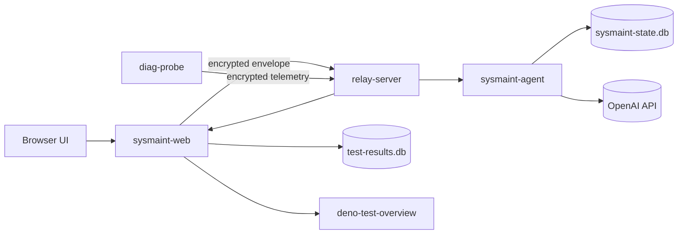

### Trust boundary at a glance

- Trusted compute boundaries (in this demo architecture): `sysmaint-web` runtime and `sysmaint-agent` runtime.
- Transport boundary: `relay-server` (routing, queueing, delivery).
- External AI boundary: OpenAI API calls from agent and Deno service.

---

## 2. Monorepo Layout and Ownership

### `packages/*` (shared/core code)

- `packages/shared`
  - Owns envelope schema and envelope parsing.
- `packages/signal-core`
  - Owns Signal state, key/session stores, encrypt/decrypt primitives.
- `packages/sysmaint-protocol`
  - Owns typed app-level message schema (`chat.prompt`, `chat.reply`, telemetry, control).
- `packages/relay-server`
  - Owns relay APIs, message queue persistence, and WS delivery logic.

### `apps/*` (executable behaviors)

- `apps/sysmaint-web`
  - UI pages, API routes, test dashboard, chat + demo orchestration.
- `apps/sysmaint-agent`
  - Receives encrypted messages, runs tools, sends encrypted replies.
- `apps/diag-probe`
  - Collects host/relay stats and sends encrypted telemetry.
- `apps/cli`
  - Developer/operator interface for Signal and relay operations.

---

## 3. Signal Protocol E2EE in This Repo

### 3.1 Two protocol layers (important)

There are two layers to keep straight:

1. **Transport envelope layer** (`packages/shared/src/envelope.ts`)
   - Who sent it, who receives it, type, timestamp, encrypted body.

2. **Application message layer** (`packages/sysmaint-protocol/src/index.ts`)
   - What the message means: prompt, reply, telemetry, control.

Think of it like:
- Envelope = secure shipping box.
- SysMaint message = content inside the box.

### 3.2 Signal-core API used by apps

Key functions from `packages/signal-core/src/index.ts`:
- `openStore(dbPath, passphrase)`
- `initializeIdentity(...)`
- `generatePreKeys(...)`
- `exportBundle(...)`
- `initSession(...)`
- `encryptMessage(...)`
- `decryptMessage(...)`

### 3.3 Signal stack in this project

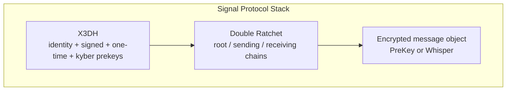

### 3.4 Outbound path (sender)

1. Build typed app message object.
2. Serialize to JSON string (`encodeSysmaintMessage`).
3. Encrypt plaintext with `encryptMessage(...)`.
4. Receive ciphertext object (`PreKey` or `Whisper`).
5. Wrap into transport envelope (`body` is base64 ciphertext bytes).
6. Send envelope to relay.

### 3.5 Inbound path (recipient)

1. Receive envelope (HTTP/WS delivery).
2. Validate envelope structure (`loadEnvelope` / schema parse).
3. Branch decrypt logic by envelope type:
   - `PreKey` -> `signalDecryptPreKey(...)`
   - `Whisper` -> `signalDecrypt(...)`
4. Decode plaintext UTF-8.
5. Parse app message (`decodeSysmaintMessage(...)`).
6. Route handler by `kind`.

### 3.6 First message vs steady-state message

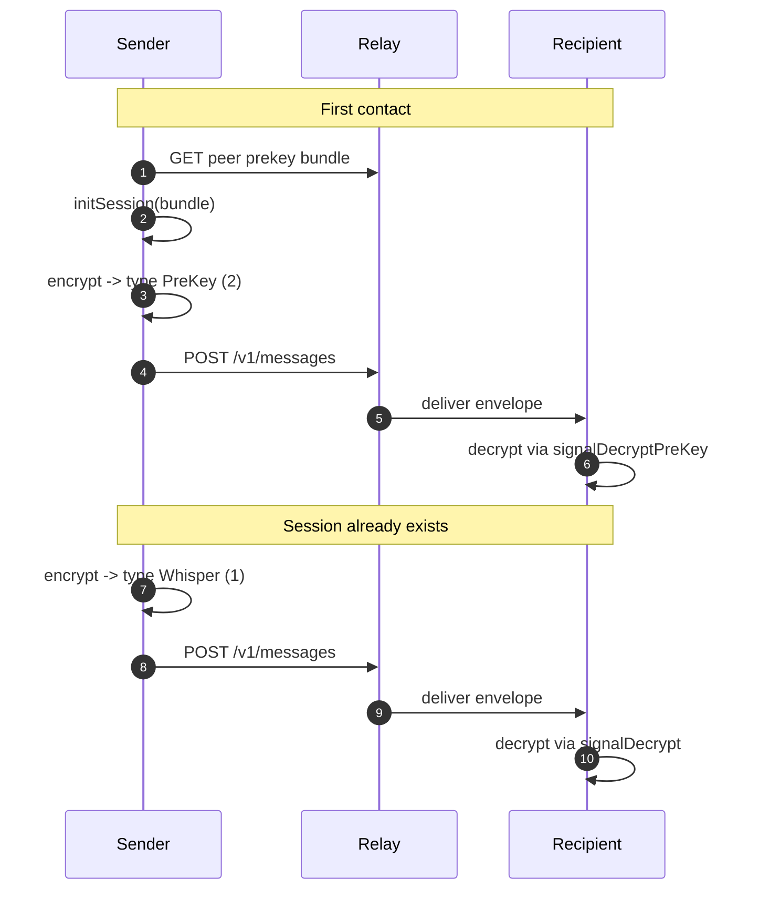

### 3.7 Key hierarchy for encrypted local state

This is about local-at-rest protection of Signal stores.

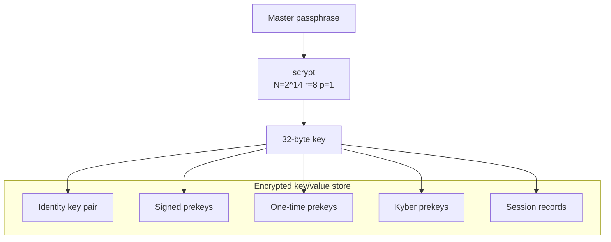

### 3.8 Why this matters for SysMaint Agentic AI

The AI loop is intentionally inside this E2EE transport model:
- Prompt enters as encrypted Signal envelope.
- Agent decrypts locally, reasons with tools, produces reply.
- Reply is re-encrypted before leaving agent runtime.

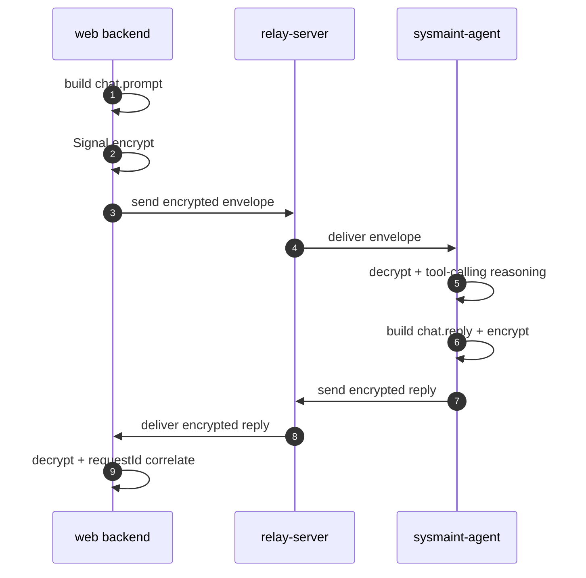

---

## 4. Relay Server Internals

### 4.1 What relay does

- Registers identities.
- Stores public prekey bundles.
- Accepts encrypted envelopes.
- Queues undelivered messages.
- Pushes messages to connected clients via WebSocket.

### 4.2 Main relay endpoints

- `GET /health`
- `GET /diagnostics`
- `POST /diagnostics/metrics`
- `POST /v1/register`
- `POST /v1/prekeys`
- `GET /v1/prekeys/:id`
- `POST /v1/messages`

### 4.3 Queue lifecycle

1. Message inserted as undelivered.
2. If recipient connected, relay tries immediate delivery.
3. Otherwise message stays queued.
4. On recipient connection, relay drains pending queue.

### 4.4 What relay can and cannot see

Relay can see:
- sender/recipient IDs
- timestamps
- message type metadata

Relay cannot (by design target) read decrypted application payload content in envelope body.

---

## 5. Core Runtime Flows

## 5.1 SysMaint chat flow (web -> relay -> agent -> relay -> web)

### What “bootstrapping” means here

In this codebase, **bootstrapping** means doing the initial Signal setup so a participant is ready for encrypted messaging.

For a user/service identity (for example Alice), bootstrapping typically includes:
1. Create or load the local Signal identity.
2. Generate prekeys.
3. Register the identity with the relay.
4. Upload a prekey bundle.
5. Prepare session state for first secure contact.

So `ensureAliceBootstrapped()` means: “make sure Alice is fully initialized and ready for E2EE message exchange.”

### Step-by-step

1. Browser calls `POST /api/chat` with prompt.
2. Web API validates and calls `sendPromptToSysmaint`.
3. Web side ensures Alice identity and session.
4. Web encrypts prompt and sends envelope to relay.
5. Agent receives envelope, decrypts, parses `chat.prompt`.
6. Agent runs LLM + tools (`get_current_status`, history, anomaly).
7. Agent builds `chat.reply`, encrypts, sends via relay.
8. Web waits on WS, receives encrypted reply, decrypts, checks `requestId`, returns response.

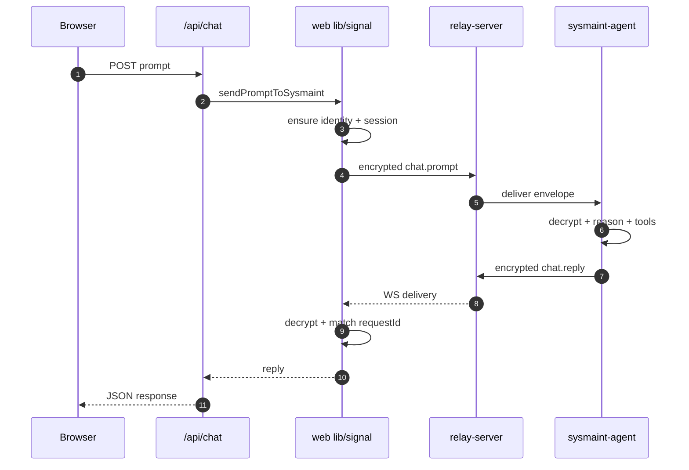

## 5.2 Telemetry flow (probe -> relay -> agent -> dashboard)

1. Probe samples `/proc` and relay diagnostics.
2. Probe builds `telemetry.report` and encrypts it.
3. Relay delivers to agent.
4. Agent decrypts and persists snapshot.
5. Web dashboard APIs read snapshots for charts.

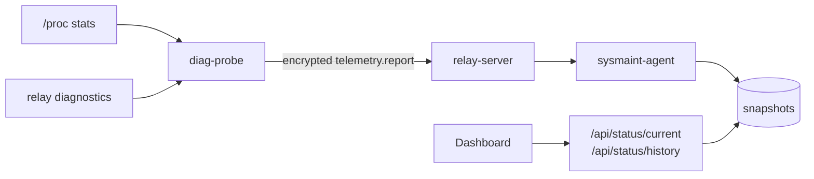

## 5.3 Alice/Bob direct E2EE demo flow

1. Alice sends message through `/api/e2ee/send`.
2. Backend encrypts and posts envelope.
3. Bob-side polling endpoint pulls encrypted messages.
4. Backend decrypts for demo display path.

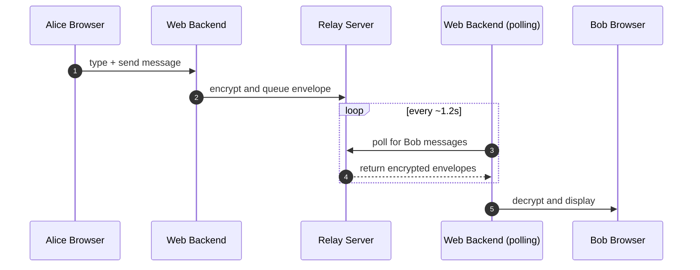

## 5.4 Test overview flow (web -> deno -> signal path)

1. UI triggers `POST /api/test/overview`.
2. Web checks Deno health and gathers test analytics data.
3. Web calls Deno `POST /analyze`.
4. Report comes back.
5. Web sends report through Signal chat flow.

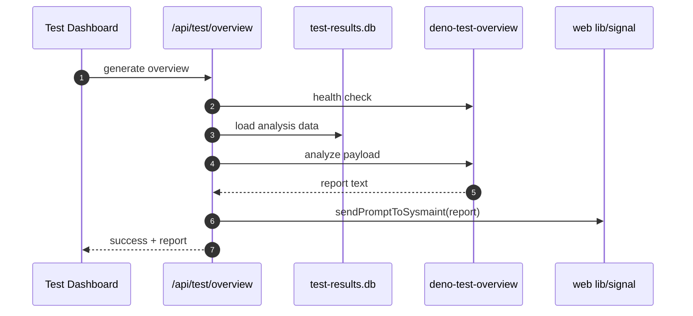

## 5.5 LangChain + OpenAI integration in SysMaint agent

This is the part of the system that turns decrypted prompts into useful operator responses.

### What happens in plain terms

1. SysMaint agent receives an encrypted prompt and decrypts it.
2. The agent builds a chat context with a strong system prompt (rules + response style).
3. LangChain binds the model to local tools.
4. The model decides whether tool calls are needed.
5. Tool outputs are fed back to the model.
6. Final answer is produced, token usage is extracted, and estimated cost is calculated.
7. Reply is encrypted and sent back through Signal flow.

### Which model and settings are used

In `apps/sysmaint-agent/src/index.ts`, the agent uses:
- `ChatOpenAI` through LangChain.
- default model: `gpt-4o-mini` (via `OPENAI_MODEL` override support).
- cost rates from env:
  - `OPENAI_INPUT_USD_PER_1M` (default `0.15`)
  - `OPENAI_OUTPUT_USD_PER_1M` (default `0.60`)

### Tool-calling behavior

The agent exposes 3 structured tools:
- `get_current_status`
- `get_recent_status_history`
- `get_anomaly_summary`

The model is prompted to choose these tools when appropriate, and each tool call is recorded in the local `tool_calls` table for traceability.

### Observability and persistence

The agent persists:
- inbound/outbound chat rows in `chat_messages`
- tool invocation records in `tool_calls`
- usage metrics (input/output/total tokens + estimated USD cost) per response

This gives a clear audit trail from encrypted prompt to encrypted reply, including what the model consulted before answering.

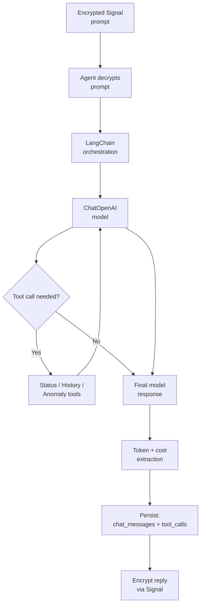

---

## 6. Web API Surface

All routes use Node runtime because of native dependencies (`better-sqlite3`, Signal bindings, WS).

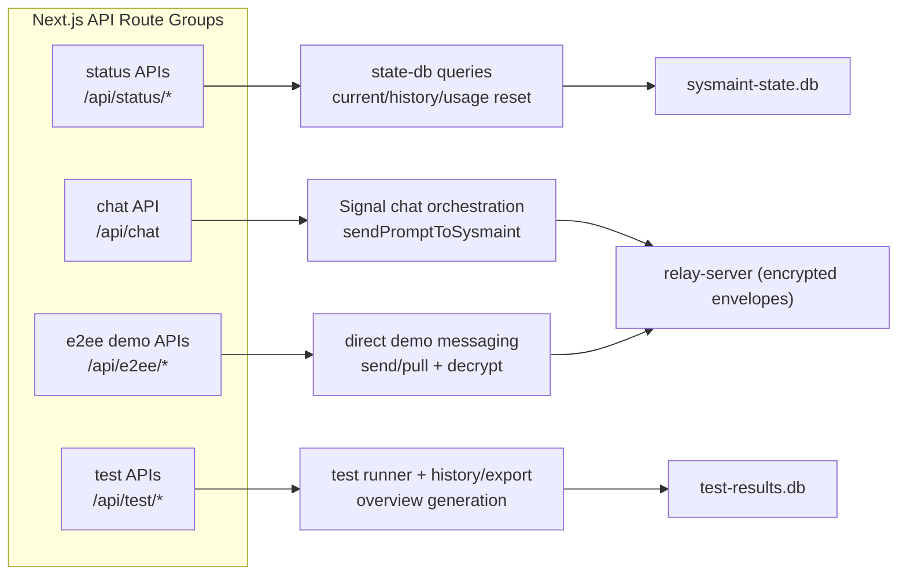

### 6.1 Status APIs

- `GET /api/status/current`
  - latest snapshot + usage summary + staleness.
- `GET /api/status/history?minutes=&limit=`
  - time-windowed snapshots with guardrails on params.
- `POST /api/status/usage/reset`
  - inserts usage reset marker.

### 6.2 Chat API

- `POST /api/chat`
  - validates prompt and executes encrypted request/reply path.

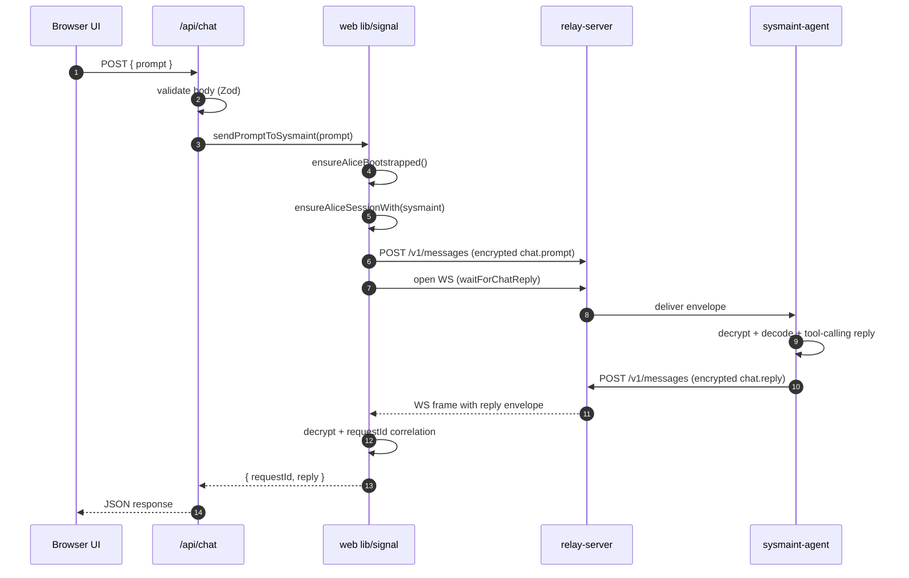

### 6.3 E2EE demo APIs

- `POST /api/e2ee/send`
  - send direct encrypted Alice/Bob message.
- `GET /api/e2ee/pull?user=alice|bob`
  - pull/decrypt available direct messages.

### 6.4 Test APIs

- `GET /api/test/run` (SSE)
- `GET /api/test/history`
- `GET /api/test/export?runId=&format=`
- `POST /api/test/overview`
- `GET /api/test/overview`

Operational note for `POST /api/test/overview`:
- Web route calls Deno service health first (`GET /health`).
- If Deno is unavailable, route returns `503` with `Deno service unavailable`.
- Web-to-Deno target defaults to `http://deno-test-overview:8000` and can be overridden by `DENO_TEST_OVERVIEW_URL`.

---

## 7. State and Persistence

### 7.1 Main DBs and who owns them

- `relay.db` (relay server)
  - identities, prekeys, message queue.
- `sysmaint-state.db` (agent writes, web reads)
  - snapshots, chat messages, tool calls, usage reset markers.
- `test-results.db` (test suite)
  - test run headers + per-test results/logs/cost fields.
- Signal state DBs per actor
  - Alice/Bob/agent/probe key/session stores.

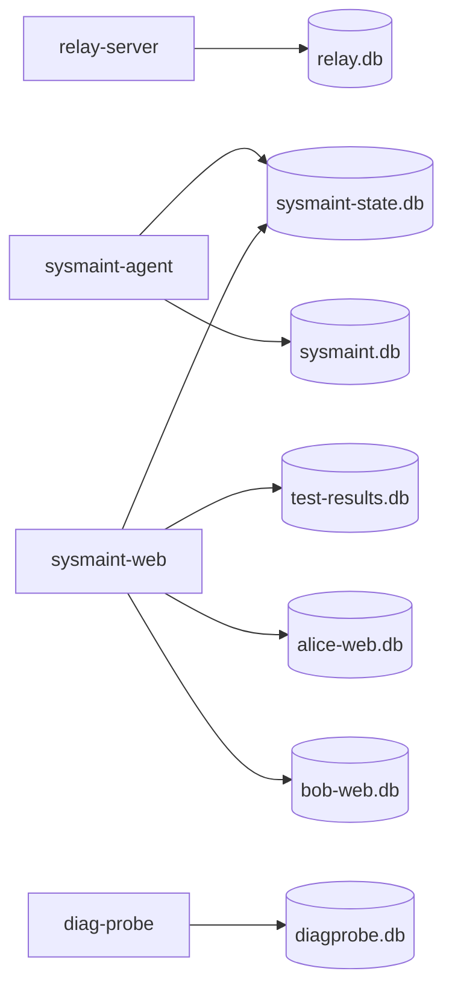

### 7.2 Usage reset semantics (easy to misunderstand)

`POST /api/status/usage/reset` does **not** delete historical snapshots.
It inserts a reset marker so future aggregates start from a new point in time.

---

## 8. Agentic Test Suite Mechanics

### 8.1 What is in the suite

15 tests total:
- 4 Signal protocol tests
- 4 E2EE tests
- 5 AI-agent tests
- 2 web/API tests

### 8.2 How the runner behaves

- Runs tests sequentially.
- Uses in-process lock (`isRunning`) to avoid overlap.
- Retries once on failure.
- Uses longer timeout for AI tests.
- Persists progress after each test.

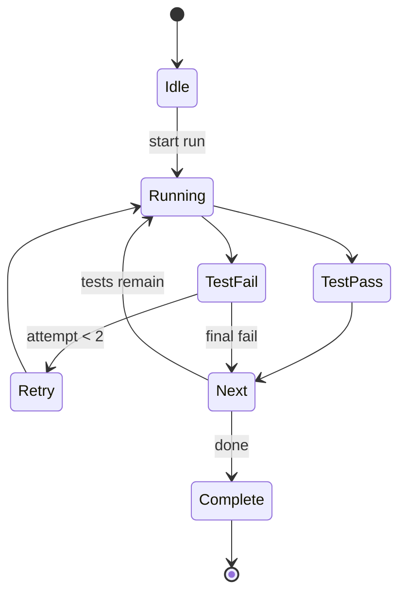

### 8.3 SSE progress stream

`GET /api/test/run` emits event frames such as:
- `run-started`
- `test-started`
- `test-progress`
- `test-retry`
- `run-completed`

---

## 9. Infrastructure and Runtime Composition

### 9.1 Docker services (current repo)

- `relay`
- `sysmaint-agent`
- `diag-probe`
- `sysmaint-web`
- `deno-test-overview`
- helper runtime images (`node`, `bun`, `deno`) and diagnostics container

### 9.2 Useful env variables to remember

- `MEGA_PASSPHRASE`
- `OPENAI_API_KEY`
- `RELAY_URL`
- `SYSMAINT_ID`, `ALICE_ID`, `BOB_ID`
- `SYSMAINT_STATE_DB`, `SYSMAINT_WEB_SIGNAL_DB`, `DIAG_PROBE_SIGNAL_DB`
- `DENO_TEST_OVERVIEW_URL`

---

## 10. Security Guarantees and Limits

### 10.1 What you get

- E2EE message transport via Signal protocol flows.
- Session evolution with PreKey and Whisper message handling.
- Runtime schema validation on both envelope and app-level payloads.
- Encrypted-at-rest local key/session stores (scrypt-derived key + AES-GCM utilities).

### 10.2 What you do not automatically get

- Metadata hiding at relay (social graph/timing still visible).
- Production-grade auth and policy by default on all routes.
- Multi-node coordination for in-process locks.

### 10.3 Production hardening checklist

1. Add authN/authZ to sensitive endpoints.
2. Add rate limits and abuse controls.
3. Enforce TLS and secret management.
4. Add alerts, audit logging, and backup policy.
5. Add distributed lock strategy for multi-instance test execution.

---

## 11. Learning Path

### Pass 1: Understand behavior, not implementation

Read:
1. `Section 1`
2. `Section 5`
3. `Section 7`

Goal: know what each component does.

### Pass 2: Understand E2EE mechanics

Read:
1. `Section 3`
2. `packages/shared/src/envelope.ts`
3. `packages/signal-core/src/index.ts`

Goal: know how messages are formed, encrypted, and decrypted.

### Pass 3: Understand operations and extension points

Read:
1. `Section 6`
2. `Section 8`
3. `apps/sysmaint-agent/src/index.ts`
4. `apps/sysmaint-web/app/api/*`

Goal: know where to add features and how to debug failures.

---

<a id="sec12-1"></a>
### 12.1 Deno test overview subsystem

- Purpose: generate formal test analysis text from stored run data.
- Interface: `GET /health`, `POST /analyze`.
- Integration point: `/api/test/overview` route in web app.
- Delivery: report is sent through existing Signal encrypted messaging path.

<a id="sec12-2"></a>
### 12.2 Design decisions and trade-offs

- Server-side Signal for web demo simplicity.
- SQLite-first design for low setup cost.
- Polling where simplicity wins over push complexity.
- Official `@signalapp/libsignal-client` for cryptographic reliability.
- LangChain tool-calling for agent extensibility.
- HTTP bridge between Node and Deno for loose coupling.

<a id="sec12-3"></a>
### 12.3 Practical runbook

```bash
# Start full stack
docker compose up -d --build

# Health checks
curl -s http://localhost:8080/health
curl -s http://localhost:3000/api/status/current
curl -s http://localhost:8000/health

# Test flow
curl -s http://localhost:3000/api/test/run
curl -s http://localhost:3000/api/test/history?limit=10
curl -s -X POST http://localhost:3000/api/test/overview
```

<a id="sec12-4"></a>
### 12.4 Troubleshooting matrix

| Symptom | Likely cause | First checks | Typical fix |
|---|---|---|---|
| `/api/test/overview` unavailable | Deno service down | `:8000/health`, container logs | restart Deno service, verify URL env |
| Chat reply timeout | relay/session/agent issue | relay health, agent logs, requestId path | re-bootstrap session, verify connectivity |
| Decrypt failures | schema/type/session mismatch | decrypt and parse errors in logs | reinit session/prekeys, validate message kinds |
| Empty pull results | polling identity mismatch | `user` query and queue state | ensure correct recipient identity |

Recovery steps for `/api/test/overview` unavailable:

```bash
# 1) Start or rebuild Deno overview service
docker compose up -d --build deno-test-overview

# 2) Confirm container is running
docker compose ps deno-test-overview

# 3) Inspect service logs
docker compose logs -f deno-test-overview

# 4) Verify direct health endpoint
curl -s http://localhost:8000/health
```

If `sysmaint-web` runs outside Docker:
- Set `DENO_TEST_OVERVIEW_URL=http://localhost:8000` so web can reach Deno over localhost.
- The default `http://deno-test-overview:8000` works when web and Deno share Docker network DNS.

Local (non-container) fallback for Deno service:

```bash
cd infra/deno/test-overview
OPENAI_API_KEY=<your_key> deno run --allow-net --allow-env main.ts
```

<a id="sec12-5"></a>
### 12.5 Performance and scaling context

Approximate expectations in this environment:
- Encrypt/decrypt: low milliseconds per message.
- Session setup: higher one-time cost than steady-state messaging.
- AI response latency: dominated by model/network behavior.

Scaling pressure points:
- in-process test lock,
- SQLite single-node constraints,
- external model latency.

<a id="sec12-6"></a>
### 12.6 Hardening checklist

1. Add route-level auth and authorization.
2. Add rate limiting.
3. Harden secret handling.
4. Add audit logs and alerts.
5. Add backup and restore checks.

<a id="sec12-7"></a>
### 12.7 Glossary alignment

Glossary terms are maintained at the top of this document in
[`Glossary (Quick Terms)`](#glossary-quick-terms) for easier onboarding.
